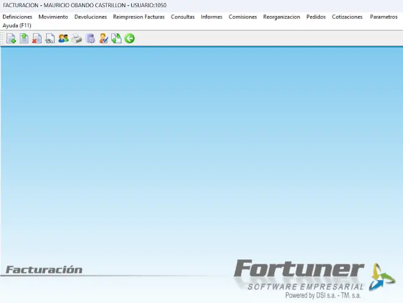
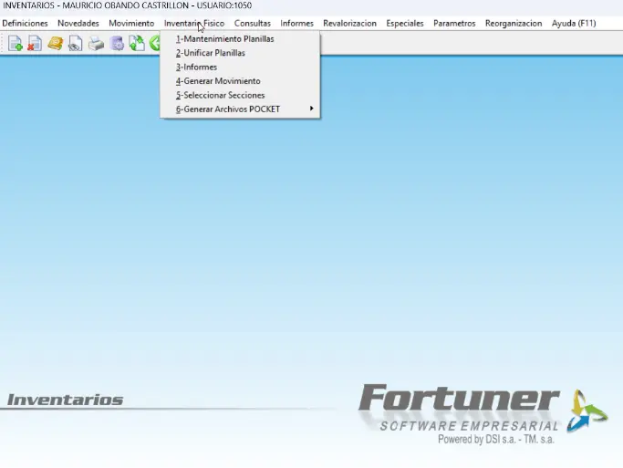
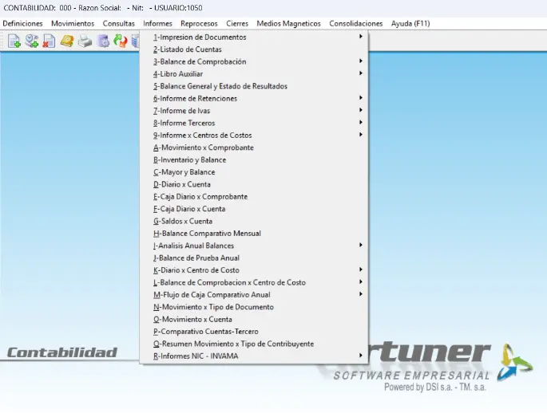
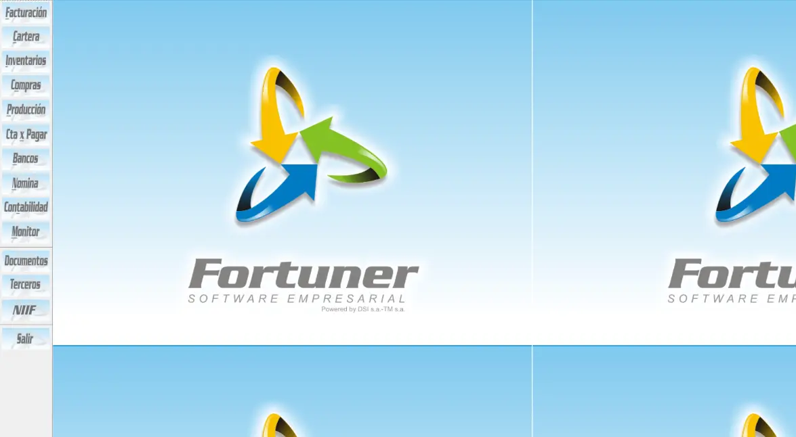

<!DOCTYPE html>
<html lang="es">

<head>
    <meta charset="UTF-8">
    <meta name="viewport"
        content="width=device-width, initial-scale=1.0, maximum-scale=5.0, user-scalable=yes, viewport-fit=cover">
    <meta name="theme-color" content="#0A2A4A">
    <meta name="apple-mobile-web-app-status-bar-style" content="black-translucent">
    <title>Fortuner ERP | Software Empresarial</title>

    
    <link
        href="https://fonts.googleapis.com/css2?family=Orbitron:wght@400;900&family=Inter:wght@300;400;700;900&family=Anton&display=swap"
        rel="stylesheet">

    <!-- Favicon Generado en Código (Isotipo 3 Flechas) -->
    <link rel="icon"
        href="data:image/svg+xml,%3Csvg xmlns='http://www.w3.org/2000/svg' viewBox='0 0 100 100'%3E%3Cg transform='translate(50, 50)'%3E%3Cpath d='M0,-30 L15,10 L-15,10 Z' fill='%23F5A623' transform='rotate(0)' /%3E%3Cpath d='M0,-30 L15,10 L-15,10 Z' fill='%230066FF' transform='rotate(120)' /%3E%3Cpath d='M0,-30 L15,10 L-15,10 Z' fill='%232ECC71' transform='rotate(240)' /%3E%3C/g%3E%3C/svg%3E">
    <link rel="apple-touch-icon" href="Imagenes/Logo-Fortuner.webp">

    
</head>

<body>

    <!-- PRELOADER -->
    

        

            

                

                

                

                

            

            
Ingresando al Sistema...

            

                

            

        

    

    <!-- BARRA DE PODER TECNOLÓGICA -->
    

        

    

    <!-- HERO -->
    <main class="main-engine">
        

            

            

            

            

            

            

            

            

            

            

        

        

            <h1 class="headline">¿Su negocio aún no está conectado?</h1>
            
<strong>Fortuner ERP</strong> integra ventas, finanzas e inventarios en una sola
                plataforma. Controle su operación con datos precisos y en tiempo real.

            <a class="cta-premium" id="openModalBtn">Agendar Demostración →</a>
        

    </main>

    <!-- CATÁLOGO DE MÓDULOS -->
    <section class="f-modules-section">
        

        

            <h2 class="modules-title">Adaptado al crecimiento de su marca</h2>
            

                

                    

                        
                    

                    <h3>FACTURACIÓN</h3>
                    
Optimice sus ventas. Facturación electrónica, POS y control de turnos. Agilice cada transacción
                        para una mejor experiencia de compra.

                    <a href="https://wa.me/573159276091?text=Hola%2C%20quiero%20mejorar%20la%20facturaci%C3%B3n%20de%20mi%20negocio%20con%20Fortuner"
                        target="_blank" class="btn-module">Conocer más →</a>
                

                

                    

                        
                    

                    <h3>INVENTARIO</h3>
                    
Controle el stock en tiempo real. Gestione compras, lotes y pronósticos de demanda para eliminar
                        quiebres de inventario.

                    <a href="https://wa.me/573159276091?text=Hola%2C%20quiero%20optimizar%20el%20inventario%20de%20mi%20negocio%20con%20Fortuner"
                        target="_blank" class="btn-module">Conocer más →</a>
                

                

                    

                        
                    

                    <h3>CONTABILIDAD</h3>
                    
Automatice su gestión financiera. Balances, flujo de caja e informes NIC. Tome decisiones
                        estratégicas con datos precisos y fiables.

                    <a href="https://wa.me/573159276091?text=Hola%2C%20quiero%20automatizar%20la%20contabilidad%20de%20mi%20negocio%20con%20Fortuner"
                        target="_blank" class="btn-module">Conocer más →</a>
                

            

        

    </section>

    <!-- PANEL DE CONTROL -->
    <section class="f-control-section">
        

            

                <h2>Controle cada área de su empresa</h2>
                
Fortuner ERP le brinda una visión 360° de su negocio. Desde el punto de venta hasta los informes
                    gerenciales, todo en un solo lugar.

                <ul class="feature-list">
                    <li>Dashboard ejecutivo en tiempo real</li>
                    <li>Integración nativa con tiendas online</li>
                    <li>Acceso móvil para supervisores y gerentes</li>
                    <li>Reportes automáticos y análisis predictivo</li>
                </ul>
            

            

                

                    
                

                <a href="Descargables/Brochure-Fortuner-2025.pdf" download class="btn-download-brochure">⬇ DESCARGAR
                    BROCHURE</a>
            

        

    </section>

    <!-- TABLA 100% FUNCIONALIDAD -->
    <section class="f-table-section">
        

            <h2 class="modules-title">Cobertura Total del Sistema</h2>
            

                

                    <table class="feature-table">
                        <thead>
                            <tr>
                                <th>Módulo / Herramienta</th>
                                <th>Funciones Clave</th>
                                <th>Sector Aplicable</th>
                            </tr>
                        </thead>
                        <tbody>
                            <tr>
                                <td><strong>Gestión Punto de Venta</strong></td>
                                <td>POS, Domicilios, Fidelización, Integración Datafonos, Kioskos, Autopagos</td>
                                <td>Retail Supermercados</td>
                            </tr>
                            <tr>
                                <td><strong>Gestión Logística</strong></td>
                                <td>Compras, Inventarios, Producción, CEDI, Traslados, EDI</td>
                                <td>Distribuidoras Logística</td>
                            </tr>
                            <tr>
                                <td><strong>Gestión Financiera</strong></td>
                                <td>Contabilidad, Facturación Electrónica, Cartera, Bancos, Costos ABC</td>
                                <td>Financiero Servicios</td>
                            </tr>
                            <tr>
                                <td><strong>Gestión Operativa</strong></td>
                                <td>E-Commerce, Taller Vehículos, Restaurantes, Acueductos</td>
                                <td>Manufactura Hospitalidad</td>
                            </tr>
                            <tr>
                                <td><strong>Gestión Administrativa</strong></td>
                                <td>Nómina Electrónica, RRHH, Analítica de Negocios (BI - Power BI/Tableau)</td>
                                <td>Empresas Industrias</td>
                            </tr>
                            <tr>
                                <td><strong>Movilidad</strong></td>
                                <td>App Móvil para pedidos, Pronósticos de demanda, Gestión en campo</td>
                                <td>Comercial Campo</td>
                            </tr>
                        </tbody>
                    </table>
                

            

        

    </section>

    <!-- PRÓXIMAMENTE 25.0 (SOLO CANDADO 3D) -->
    <section class="f-coming-section">
        

            

                

                    
🔓

                

                <h3>Próximamente 25.0</h3>
                
Nueva versión - Noviembre 2026

            

        

    </section>

    <!-- FOOTER + MAPA LEAFLET -->
    <footer class="f-footer">
        

            

                <h3>NUESTRA COBERTURA</h3>
                

                    

                

            

            

                <h4>CONTACTO FORTUNER</h4>
                
<strong>📞 Teléfono Único:</strong> 315 927 6091

                
<strong>🕒 Horario:</strong> Lunes a Viernes, 8:00 AM - 6:00 PM

                
<strong>📍 Cobertura:</strong> Nacional (Colombia)

            

        

        

            
&copy; 2026 Fortuner ERP. Todos los derechos reservados.

        

        

            Echo con pasión 🔥 por <a href="https://redsapien.com/" target="_blank">RedSapien</a>
        

    </footer>

    <!-- WHATSAPP FLOTANTE -->
    <a href="https://wa.me/573159276091?text=Hola%20Fortuner%2C%20quiero%20m%C3%A1s%20informaci%C3%B3n%20sobre%20el%20ERP"
        class="wa-float-btn" target="_blank" rel="noopener noreferrer">
        <svg class="wa-icon-svg" viewBox="0 0 24 24">
            <path
                d="M12.032 1.999c-5.514 0-10 4.486-10 9.999 0 1.763.457 3.475 1.323 4.982l-1.343 4.846 4.96-1.308c1.456.792 3.119 1.211 4.828 1.211 5.514 0 10-4.486 10-10s-4.486-10-10-10zm0 18.5c-1.497 0-2.96-.4-4.239-1.155l-.295-.176-2.944.777.787-2.864-.192-.305c-1.395-2.221-1.512-4.784-.238-6.981 1.16-2.002 3.352-3.239 5.734-3.239 3.585 0 6.5 2.915 6.5 6.5s-2.915 6.5-6.5 6.5zm3.729-4.857c-.2-.098-1.164-.574-1.344-.639s-.31-.098-.441.098c-.131.196-.51.64-.625.771s-.23.149-.429.05c-.92-.46-1.94-1.139-2.653-2.035-.275-.346-.717-.896-.111-1.045.282-.069.439-.23.534-.365.045-.069.078-.13.12-.216.03-.064.02-.121-.01-.172-.03-.05-.418-1.007-.577-1.383-.153-.362-.309-.312-.425-.315l-.363-.013c-.122 0-.327.046-.498.232-.247.27-.855.835-.855 2.037 0 1.202.875 2.363.997 2.526.122.165 1.724 2.631 4.176 3.688.416.179.791.254 1.084.267.453.022 1.311.019 1.774-.099.575-.147 1.157-.605 1.32-1.189.163-.584.163-1.082.114-1.185-.047-.102-.172-.166-.372-.265z" />
        </svg>
    </a>

    <!-- MODAL 3 PASOS (Nombre -> Sector -> Fecha Full) -->
    

        

            <button class="f-modal-close" id="closeModalBtn">✕</button>

            <!-- PASO 1: NOMBRE -->
            

                <h3>¿Cómo se llama su negocio?</h3>
                
Ingrese el nombre de su empresa o emprendimiento.

                <input type="text" id="businessName" placeholder="Ej: Distribuidora XYZ" autofocus>
                <button class="f-modal-btn" id="step1Btn">Siguiente →</button>
                
Paso 1 de 3

            

            <!-- PASO 2: SECTOR (Solo 4 tarjetas) -->
            

                <h3>Seleccione su sector</h3>
                
Elija su industria para continuar.

                

                    
🛒Supermercados

                    
🏪Minoristas
                    

                    
🍽️Gastronomía
                    

                    
🚚Logística

                

                
Paso 2 de 3

            

        

    

    <!-- MODAL FULL (PASO 3: FECHA/HORA) - APARECE EN PANTALLA COMPLETA -->
    

        

            <button class="f-modal-close" onclick="closeFullModal()">✕</button>
            

                <h3>Agende su demostración</h3>
                
Seleccione la fecha y hora
                    ideales para usted.

                

                    

                        <button id="prevMonthFull">‹</button>
                        Enero 2026
                        <button id="nextMonthFull">›</button>
                    

                    

                

                

                    
09:00 AM

                    
11:00 AM

                    
02:00 PM

                    
04:00 PM

                

                <button class="f-modal-btn" id="step3Btn" disabled style="margin-top: 30px;">Confirmar y Agendar
                    📞</button>
            

        

    

    <!-- IMAGE MODAL -->
    

        
        <button
            style="position:absolute; top:25px; right:30px; background:rgba(255,255,255,0.1); border:none; color:#fff; font-size:30px; cursor:pointer; width:50px; height:50px; border-radius:50%; transition:0.3s;"
            onclick="closeImageModal()">✕</button>
    

    <!-- SCRIPTS -->
    
    <link rel="stylesheet" href="https://unpkg.com/leaflet@1.9.4/dist/leaflet.css" />
    

    
</body>

</html>
